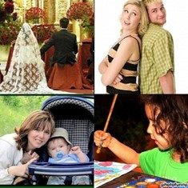

---
annotations_creators:
- expert-generated
language:
- en
language_creators:
- expert-generated
license:
- unknown
multilinguality:
- monolingual
pretty_name: SRCNN dataset
size_categories:
- 1K<n<10K
source_datasets:
- original
tags:
- Srcnn
- peopleimage
task_categories:
- image-to-text
task_ids:
- image-captioning
---

# Dataset Card for Image Enhancement using SRCNN

## Table of Contents
- [Table of Contents](#table-of-contents)
- [Dataset Description](#dataset-description)
  - [Dataset Summary](#dataset-summary)
  - [Languages](#languages)
- [Dataset Structure](#dataset-structure)
  - [Data Fields](#data-fields)
  - [Data Splits](#data-splits)
- [Dataset Creation](#dataset-creation)
  - [Curation Rationale](#curation-rationale)
  - [Source Data](#source-data)
  - [Annotations](#annotations)
  - [Personal and Sensitive Information](#personal-and-sensitive-information)
- [Considerations for Using the Data](#considerations-for-using-the-data)
  - [Other Known Limitations](#other-known-limitations)
- [Additional Information](#additional-information)
  - [Dataset Curators](#dataset-curators)
  - [Licensing Information](#licensing-information)

## Dataset Description

- **Homepage:** https://www.kaggle.com/datasets/ahmadahmadzada/images2000
- **Point of Contact:** smalekzp@gmail.com

### Dataset Summary

The dataset is taken from a kaggle dataset challenge,
consisting 2053 different images of peoples
performing different activities in various walks of
life.Each image has a different resolution and size,
ranging from(300 X 300) with a resolution of (96
X 96) dpi to the largest image (448 X 300) with a
resolution of (96 X 96) dpi.

### Languages

According to the author all the descriptions are in English.

## Dataset Structure

After the dataset is downloaded and extracted. We will have two folders containing the raw image files and an excel file that stores the description of each image mapped to the id's of the image files.

├── images

    ├── images

├── images_info.xlsx        
    

### Data Fields

image_info contains three fields. "id","file_id" and "captions" but since we are working on super resolution we will leave out the whole excel dataset.

### Data Splits

The dataset splitted into train and test with percentile of 80% and 20% respectively.1643 and 410 interms of number of images.

## Dataset Creation
The dataset was created by the autor. orginally, it was intended for image captioning to generate textual description of an image.

### Curation Rationale

According to the author:

This image dataset can be used for Image Captioning to generate textual description of an image.

### Source Data

#### Initial Data Collection and Normalization

To fetch the data set the notebook is presented [here](https://www.kaggle.com/code/kerneler/starter-images2000-119dd37a-6)

JPG version of images are located in images folder and description of images is image info.xlsx file. image info.xlsx file contains information about id, image name and, caption of the image.

#### Who are the source language producers?

According to the autor the whole data was scrapped from https://freerangestock.com/gallery.php?gid=42&page_num=1&orderby=code

### Annotations

As previously stated sice we are only interested in the image data, no annotation pre-process was performed.

### Personal and Sensitive Information

The dataset is orginally created from freerange. and freerange stated that their images are licensed under Equalicense and they allowed anyone to use the images for nearly any purpose, commercial or non-commercial, without attribution.

## Considerations for Using the Data

### Other Known Limitations

As already been discribed the dataset contains images with resolution range from (300 X 300) to (448 X 300) in which its low resolution for our use case.

## Additional Information

### Dataset Curators

As previously mention, the curator of dataset is [AHMAD AHMADZADA] (https://www.kaggle.com/ahmadahmadzada)

### Licensing Information
The kaggle dataset is not liscensed but the images from freerange are licensed under Equalicense.