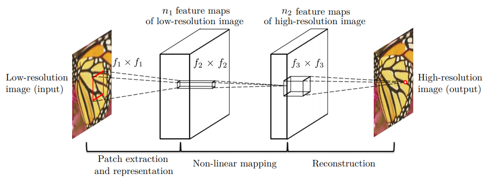
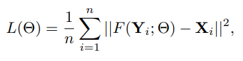

## Table of Contents
- [Table of Contents](#table-of-contents)
- [Model Description](#model-description)
  - [Model Architecture](#dataset-architecture)
  - [Loss Function](#loss-function)
- [Performance Matrices](#performance-matrices)
  - [PSNR](#psnr)
- [Dataset](#dataset)
  - [Dataset Description](#dataset-description)
  - [Data Pre-Processing](#source-data)
- [Additional Information](#additional-information)
  - [Licensing Information](#licensing-information)

  ## Model Description

  ### Model Architecture

  The original architecture conceptually
consists of 3 components: Feature extractor,
non-linear mapping, reconstruction. Each are responsible
for extracting low-resolution features, mapping
into high resolution features, reconstruction.
The low resolution image is bi-cubic interpolated
into Y, with the same size as the high resolution
image, X. The model aims to learn a mapping F:
Y→ X.
Conclusively, each component turns out to be
represented as one convolution layer, resulting a
3-layer convolutional neural network, with kernel
size 9,1,5.

After tunning the hyper-parameter, the model shows some improvement regarding the loss rate and the complexity of the parameter.The increase in complexity will force our machine to spend extra space and time.

Also to overcome the under-fitting performance of the model.An excess neural layers were introduced so that it can benefit from increasing the depth. now the model's architecture is 9-5-5-5-1-5.

  ### Loss function
  The loss function is defined as the
  pixelwise MSE(MeanSquared Error) between the reconstructed image F(Y) and the ground truth image X.
  This will result in training to maximizing the PSNR measure.

  

  ## Performance Matrices

For the performance of the network we used peak
signal to noise ratio (PSNR).

  ### PSNR
  PSNR computes the
peak signal-to-noise ratio, in decibels, between two
images. This ratio is used as a quality measurement
between the original and a enhanced image.
The higher the PSNR, the better the quality of the
reconstructed image.

## DataSet

### Dataset Description
The dataset is taken from a kaggle dataset challenge,
consisting 2053 different images of peoples
performing different activities in various walks of
life.Each image has a different resolution and size,
ranging from(300 X 300) with a resolution of (96
X 96) dpi to the largest image (448 X 300) with a
resolution of (96 X 96) dpi.

The complete description can be found [here](https://github.com/se4ai2223-uniba/image_enhancement/blob/develop/data/README.md)

### Dataset Pre-processing
Pre-processing mechanisms has been performed to
get the best out the given algorithm. For example
when we run images through SRCNN, due to
the concept of kernel sizes and convolutional layers,
some of these outer pixels will be lost, the
images become smaller, and therefore a divisible
image size would be required. To solve this problem,
we crop the image and make it divisible by
scaling.

## Additional Information
### Licensing Information
MIT
